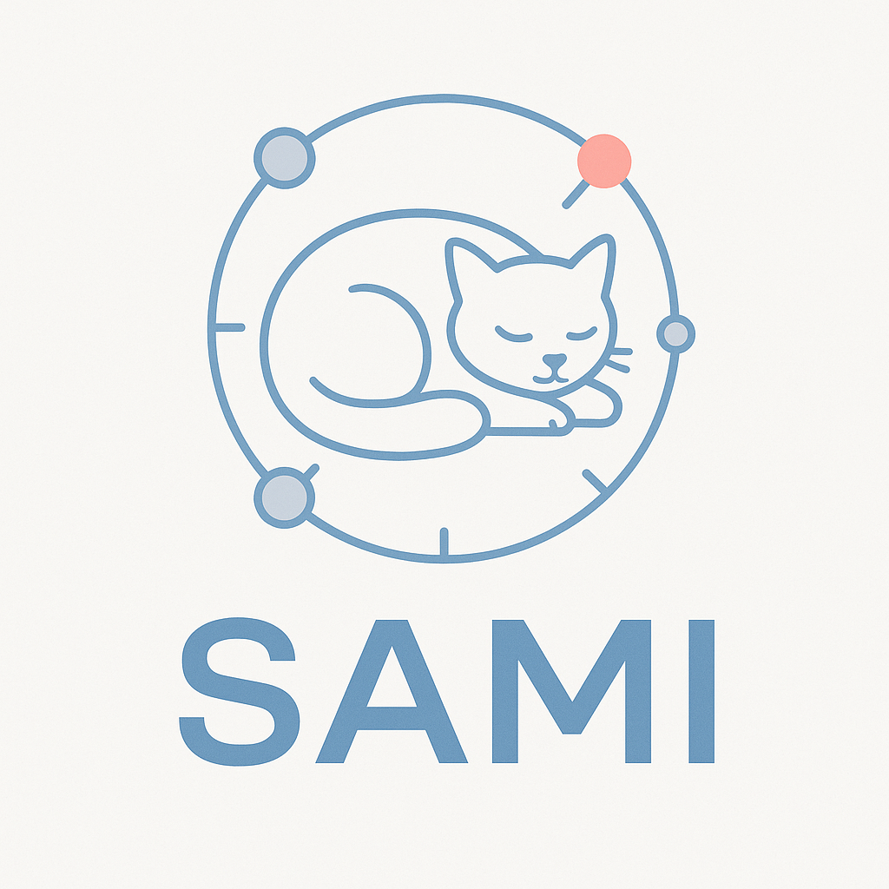

# SAMI v2 - System Architecture Mapping Interface



**SAMI** es una plataforma open source para visualizar, gestionar y documentar arquitecturas de sistemas de software de manera interactiva y colaborativa.

## 🚀 Características Principales

### 📊 Visualización Interactiva
- **Diagramas de flujo dinámicos** con React Flow
- **Múltiples temas visuales** (Volcánico, Matrix, Eléctrico, Cósmico, etc.)
- **Fondos personalizables** con efectos visuales avanzados
- **Leyendas colapsables** para maximizar el espacio de trabajo
- **Minimapa integrado** para navegación rápida

### 🔧 Gestión de Servicios
- **Creación y edición** de servicios con detalles completos
- **Tipos de servicio** predefinidos (API, Database, Cache, Queue, etc.)
- **Estados de servicio** (Active/Inactive) con indicadores visuales
- **Metadatos extensibles** para cada servicio
- **Operaciones avanzadas**: copiar, pegar, duplicar, deshacer/rehacer

### 🔗 Gestión de Dependencias
- **Conexiones visuales** entre servicios
- **Múltiples protocolos** (HTTP/REST, gRPC, WebSocket, Database, etc.)
- **Edición de conexiones** con click directo
- **Tipos de dependencia** con colores distintivos
- **Validación automática** de conexiones

### 💾 Persistencia y Colaboración
- **Autoguardado inteligente** con indicadores de estado
- **Historial de cambios** con undo/redo
- **Comentarios por proyecto** y servicio
- **Gestión de usuarios** con roles y permisos
- **API REST completa** para integración

### 🎨 Experiencia de Usuario
- **Interfaz moderna** con Tailwind CSS
- **Componentes reutilizables** con shadcn/ui
- **Responsive design** para todos los dispositivos
- **Atajos de teclado** para mayor productividad
- **Estados persistentes** en localStorage

## 🛠️ Stack Tecnológico

### Frontend
- **Next.js 14** - Framework React con App Router
- **TypeScript** - Tipado estático
- **React Flow** - Visualización de diagramas
- **Tailwind CSS** - Estilos utilitarios
- **shadcn/ui** - Componentes de UI
- **Lucide React** - Iconografía

### Backend
- **Go** - Lenguaje de programación
- **Gin** - Framework web
- **PostgreSQL** - Base de datos relacional
- **JWT** - Autenticación
- **CORS** - Configuración de seguridad

## 📦 Instalación

### Prerrequisitos
- Node.js 18+ 
- Go 1.21+
- PostgreSQL 13+
- Git

### Configuración del Backend

```bash
# Clonar el repositorio
git clone https://github.com/imnotUrban/sami.git
cd sami

# Configurar la base de datos PostgreSQL
createdb sami_db

# Configurar variables de entorno
cp backend/.env.example backend/.env
# Editar backend/.env con tus configuraciones

# Instalar dependencias y ejecutar
cd backend
go mod tidy
go run main.go
```

### Configuración del Frontend

```bash
# Navegar al directorio del frontend
cd frontend-sami

# Instalar dependencias
npm install

# Configurar variables de entorno
cp .env.local.example .env.local
# Editar .env.local con la URL de tu backend

# Ejecutar en modo desarrollo
npm run dev
```

## 🚀 Uso

1. **Accede a la aplicación** en `http://localhost:3000`
2. **Crea una cuenta** o inicia sesión
3. **Crea un nuevo proyecto** desde el dashboard
4. **Agrega servicios** usando el botón "Add Service"
5. **Conecta servicios** arrastrando desde los puntos de conexión
6. **Personaliza la vista** con diferentes fondos y temas
7. **Colabora** agregando comentarios y compartiendo proyectos

### Atajos de Teclado
- `Ctrl + C` - Copiar servicio seleccionado
- `Ctrl + V` - Pegar servicio copiado
- `Ctrl + Z` - Deshacer última acción
- `Ctrl + Shift + Z` - Rehacer acción

## 🤝 Contribuir

¡Las contribuciones son bienvenidas! Este es un proyecto open source y valoramos la participación de la comunidad.

### Cómo Contribuir

1. **Fork el repositorio**
2. **Crea una rama** para tu feature (`git checkout -b feature/AmazingFeature`)
3. **Commit tus cambios** (`git commit -m 'Add some AmazingFeature'`)
4. **Push a la rama** (`git push origin feature/AmazingFeature`)
5. **Abre un Pull Request**

### Reportar Bugs

Si encuentras un bug, por favor [abre un issue](https://github.com/imnotUrban/sami/issues) con:
- Descripción detallada del problema
- Pasos para reproducir
- Capturas de pantalla si es relevante
- Información del entorno (OS, navegador, versiones)

### Solicitar Features

Para solicitar nuevas características:
1. [Abre un issue](https://github.com/imnotUrban/sami/issues) con la etiqueta "enhancement"
2. Describe la funcionalidad deseada
3. Explica el caso de uso
4. Proporciona mockups si es posible

## 📄 Licencia

Este proyecto está licenciado bajo la **GPL-3.0 License** - ver el archivo [LICENSE](LICENSE) para más detalles.

### ¿Qué significa GPL-3.0?

- ✅ **Uso comercial** - Puedes usar SAMI en proyectos comerciales
- ✅ **Modificación** - Puedes modificar el código fuente
- ✅ **Distribución** - Puedes distribuir el software
- ✅ **Uso privado** - Puedes usar SAMI de forma privada
- ⚠️ **Copyleft** - Las modificaciones deben mantener la misma licencia
- ⚠️ **Divulgación del código** - Debes proporcionar el código fuente

## 👥 Equipo

- **[@imnotUrban](https://github.com/imnotUrban)** - Desarrollador Principal

## 🙏 Agradecimientos

- [React Flow](https://reactflow.dev/) - Por la excelente librería de diagramas
- [shadcn/ui](https://ui.shadcn.com/) - Por los componentes de UI
- [Tailwind CSS](https://tailwindcss.com/) - Por el sistema de estilos
- [Lucide](https://lucide.dev/) - Por los iconos
- La comunidad open source por su inspiración y apoyo

## 📞 Contacto

- **GitHub**: [imnotUrban](https://github.com/imnotUrban)
- **Issues**: [GitHub Issues](https://github.com/imnotUrban/sami/issues)

## 🗺️ Roadmap

### v2.1 (Próximo)
- [ ] Exportación a diferentes formatos (PNG, SVG, PDF)
- [ ] Templates de arquitectura predefinidos
- [ ] Integración con Git para versionado automático
- [ ] Métricas y analytics de arquitectura

### v2.2 (Futuro)
- [ ] Colaboración en tiempo real
- [ ] Integración con herramientas de CI/CD
- [ ] API pública para integraciones
- [ ] Modo offline con sincronización

---

**⭐ Si SAMI te resulta útil, considera darle una estrella al repositorio para apoyar el proyecto!**

## 📊 Estadísticas del Proyecto


 